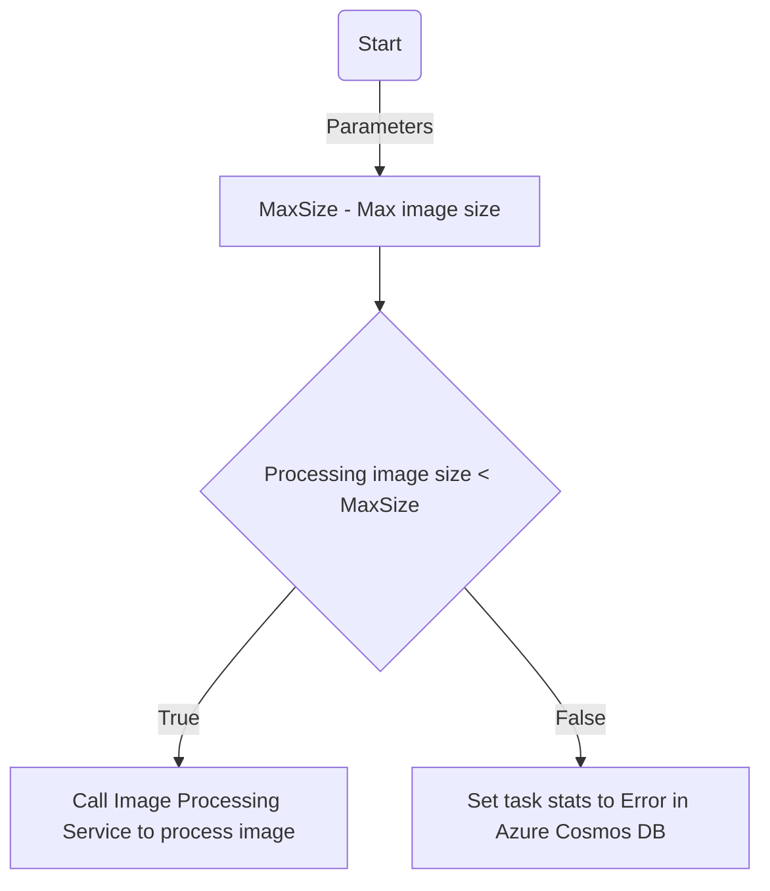

# Image processing solution (Powered by Azure)

This is the implementation of a test task, the main idea of which is to get acquainted and get an experience with the following Azure resources:

- [Blob Storage](https://learn.microsoft.com/en-us/azure/storage/blobs/storage-blobs-introduction);
- [Cosmos DB](https://learn.microsoft.com/en-us/azure/cosmos-db/introduction);
- [Service Bus Topics](https://learn.microsoft.com/en-us/azure/service-bus-messaging/service-bus-queues-topics-subscriptions);
- [App Logic](https://learn.microsoft.com/en-us/azure/logic-apps/logic-apps-overview);
- [Container Apps](https://learn.microsoft.com/en-us/azure/container-apps/overview);
- [API Management](https://learn.microsoft.com/en-us/azure/api-management/api-management-key-concepts).

## Solution

### Task Manager Service

Key moments:

- Frontend powered by SwaggerUI;
- Two endpoints: `Image` and `Tasks`;
- Deployed as container and running as container app;

Service API:

- `Image` endpoint:
  - Upload the image to Blob Store;
  - Generate and upload task info to Cosmos DB;
- `Tasks` endpoint:
  - Provide information about all tasks that are stored in Cosmos DB;
  - Provide information about the task by specifying task identification.

### Image Processing Service

Key moments:

- Frontend powered by SwaggerUI;
- One endpoint: `Tasks`;
- Deployed as container and running as container app;

Service API:

- `Tasks` endpoint:
  - Process the specified task (*Rotate an uploaded image 180 degrees*).

### Logic app workflow

## Point of improvements

Implementation:

- Move from using Cosmos DB client directly to Repository pattern;
- Implement server-side caching;
- Move business logic from controllers to models;
- Improve logging;

Authentication:

- Support different auth methods provided by Azure;

## Additional documentations

- [Contribution guide](./.documentation/contribution-guide.md)
- [Local development story](./.documentation/local-development-story.md)
